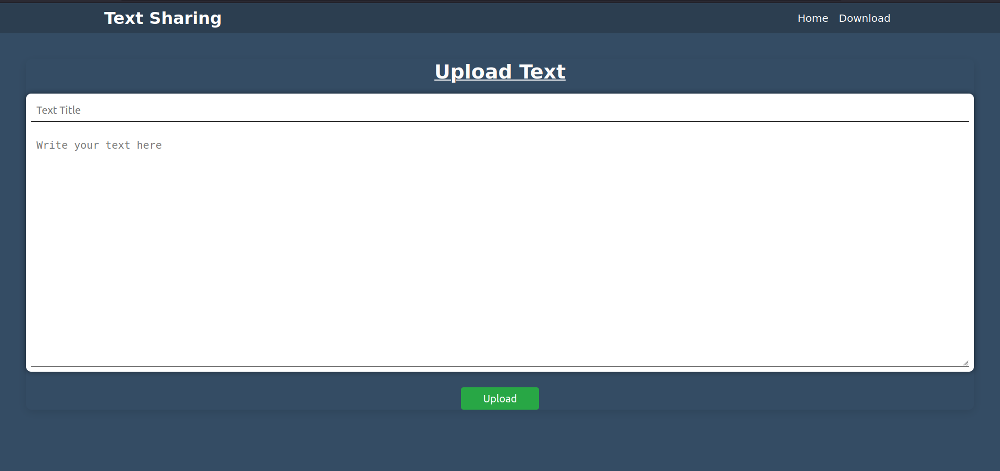
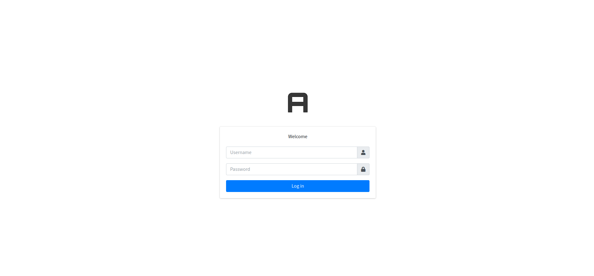

# Text Sharing WebApp

A simple Django-based Text-sharing platform where users can upload their text content and receive a unique link or Text ID to access the text Content. The text content and links will automatically expire and be deleted after 24 hours.


#### Home Page 


#### Admin Page 


## Features

- Text Content upload with a unique link generated for each file
- Auto-delete uploaded text content and links after 24 hours
- Copy text URL and file ID to clipboard
- Handle expired text content by removing them from the database

## Usages
You System must have the following things to use this Text Sharing App.
 - Installation of `python` and  `pip`

    Python is available for every platform. Download it according to you os. You can download it from [Here.](https://www.python.org/downloads/)


Follow the mentioned procedure to run this project in your local system.
 - Clone or Download the Repository
```bash
    git clone https://github.com/santoshvandari/TextSharing.git 
    cd TextSharing
```
 - Create the Virtual Environment Before installing the requirements. 
 ```Bash
    python3 -m virtualenv venv #For Linux User
 ```
  - Activate the Virtual Environment
  ```bash
    source venv/bin/activate  #For Linux
     Note: It is not Necessary to Create Virtual Environment but recommanded.
  ``` 
 - Install the Requirements
```bash
    pip install -r requirements.txt
```
 - Make the Migrations and Migrate the Model
 ```bash
    # For making the Migrations
    python3 manage.py makemigrations
    # For Migrating the Model 
    python3 manage.py migrate
```
 - Create Super User
```bash 
    python3 manage.py createsuperuser
    #Fill the Required Information
```
 - Run the Server
```bash
    python3 manage.py runserver #FOr Linux User
```
 - Open the url in Browser
 ```bash
    http://127.0.0.1:8000/  #For Home
    http://127.0.0.1:8000/admin # For Admin Login
 ```

## Contributing
We welcome contributions! If you'd like to contribute to this Text Sharing app, please check out our [Contribution Guidelines](Contribution.md).

## Code of Conduct
Please review our [Code of Conduct](CodeOfConduct.md) before participating in this app.

## License
This project is licensed under the [License](LICENSE).